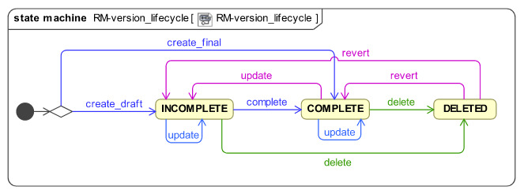
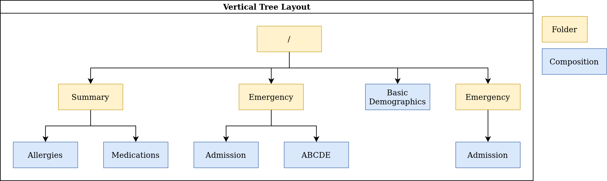

# openEHR Conformance Testing Specification (EHR/CONTRIBUTION)

| Author                                           | Version          | Comments                                                   |
|:------------------------------------------------:|:----------------:|:----------------------------------------------------------:|
| Pablo Pazos Gutierrez <pablo.pazos@cabolabs.com> | 1.0 (2021-04-30) | Split documentation of CONTRIBUTION from the EHR/COMPOSITION suite, improved grammar, fixed descriptions, added extra notes. |

# Index
<!-- 
  $ git clone https://github.com/Chris3606/TOC-Generator
  $ cd TOC-Generator
  $ python tocgen.py ../ehrbase/doc/conformance_testing
-->
<!--ts-->
- [EHR/CONTRIBUTION Validation Suite](#ehrcontribution-validation-suite)
  - [A. General Requirements](#a-general-requirements)
  - [B. CONTRIBUTION Test Case Data Sets](#b-contribution-test-case-data-sets)
    - [B.1. General Commit CONTRIBUTION Data Sets](#b1-general-commit-contribution-data-sets)
    - [B.2. COMPOSITION Commit CONTRIBUTION Data Sets](#b2-composition-commit-contribution-data-sets)
      - [B.2.1. Considerations for the test data sets](#b21-considerations-for-the-test-data-sets)
      - [B.2.2. Combinations for data sets](#b22-combinations-for-data-sets)
    - [B.3. EHR_STATUS Commit CONTRIBUTION Test Data Sets](#b3-ehr_status-commit-contribution-test-data-sets)
      - [B.3.1. Combinations for data sets](#b31-combinations-for-data-sets)
    - [B.4. FOLDER Commit CONTRIBUTION Test Data Sets](#b4-folder-commit-contribution-test-data-sets)
      - [B.4.1. Combinations for data sets](#b41-combinations-for-data-sets)
  - [C. Commit CONTRIBUTION of COMPOSITIONs Flows](#c-commit-contribution-of-compositions-flows)
    - [C.1. Main flow: successfully commit CONTRIBUTION of `VERSION<COMPOSITION>`](#c1-main-flow-successfully-commit-contribution-of-versioncomposition)
    - [C.2. Alternative flow 1: commit CONTRIBUTION with errors in `VERSION<COMPOSITION>`](#c2-alternative-flow-1-commit-contribution-with-errors-in-versioncomposition)
    - [C.3. Alternative flow 2: commit invalid CONTRIBUTION (no VERSIONs provided)](#c3-alternative-flow-2-commit-invalid-contribution-no-versions-provided)
    - [C.4. Alternative flow 3: commit CONTRIBUTION with a mix of valid and invalid `VERSION<COMPOSITION>`](#c4-alternative-flow-3-commit-contribution-with-a-mix-of-valid-and-invalid-versioncomposition)
    - [C.5. Alternative flow 4: commit CONTRIBUTIONS versioning event COMPOSITIONs](#c5-alternative-flow-4-commit-contributions-versioning-event-compositions)
    - [C.6. Alternative flow 5: commit CONTRIBUTIONS versioning persistent COMPOSITION](#c6-alternative-flow-5-commit-contributions-versioning-persistent-composition)
    - [C.7. Alternative flow 6: commit CONTRIBUTIONS deleting a COMPOSITION](#c7-alternative-flow-6-commit-contributions-deleting-a-composition)
    - [C.8. Alternative flow 7: commit CONTRIBUTIONS for versioning, the second commit contains errors](#c8-alternative-flow-7-commit-contributions-for-versioning-the-second-commit-contains-errors)
    - [C.9. Alternative flow 8: commit CONTRIBUTIONS for versioning a persistent COMPOSITION, the second commit has change type creation](#c9-alternative-flow-8-commit-contributions-for-versioning-a-persistent-composition-the-second-commit-has-change-type-creation)
    - [C.10. Alternative flow 9. commit CONTRIBUTION with COMPOSITION referencing a non existing OPT](#c10-alternative-flow-9-commit-contribution-with-composition-referencing-a-non-existing-opt)
  - [D. Commit CONTRIBUTIONS of EHR_STATUS Flows](#d-commit-contributions-of-ehr_status-flows)
    - [D.1. Main flow: successfully commit CONTRIBUTION of `VERSION<EHR_STATUS>`](#d1-main-flow-successfully-commit-contribution-of-versionehr_status)
    - [D.2. Alternative flow 1: successfully commit CONTRIBUTION of `VERSION<EHR_STATUS>`, full EHR_STATUS](#d2-alternative-flow-1-successfully-commit-contribution-of-versionehr_status-full-ehr_status)
    - [D.3. Alternative flow 2: fail commit CONTRIBUTION of `VERSION<EHR_STATUS>`, wrong change_type](#d3-alternative-flow-2-fail-commit-contribution-of-versionehr_status-wrong-change_type)
    - [D.4. Alternative flow 3: fail commit CONTRIBUTION of `VERSION<EHR_STATUS>`, invalid EHR_STATUS](#d4-alternative-flow-3-fail-commit-contribution-of-versionehr_status-invalid-ehr_status)
  - [E. Commit CONTRIBUTIONS of FOLDER Flows](#e-commit-contributions-of-folder-flows)
    - [E.1. Alternative flow 12: successfully commit CONTRIBUTION of `VERSION<FOLDER>`](#e1-alternative-flow-12-successfully-commit-contribution-of-versionfolder)
    - [E.2. Alternative flow 13: fail commit CONTRIBUTION of `VERSION<FOLDER>` FOLDER exists](#e2-alternative-flow-13-fail-commit-contribution-of-versionfolder-folder-exists)
    - [E.3. Alternative flow 14: fail commit CONTRIBUTION of `VERSION<FOLDER>` update](#e3-alternative-flow-14-fail-commit-contribution-of-versionfolder-update)
    - [E.4. Alternative flow 15: successful commit CONTRIBUTION of `VERSION<FOLDER>` update](#e4-alternative-flow-15-successful-commit-contribution-of-versionfolder-update)
  - [F. List CONTRIBUTIONs](#f-list-contributions)
    - [F.1. Main flow: list CONTRIBUTIONS of existing EHR with a just committed CONTRIBUTION (COMPOSITION)](#f1-main-flow-list-contributions-of-existing-ehr-with-a-just-committed-contribution-composition)
    - [F.2. Alternative flow 1: list CONTRIBUTIONS of existing EHR with no CONTRIBUTIONS (ANY)](#f2-alternative-flow-1-list-contributions-of-existing-ehr-with-no-contributions-any)
    - [F.3. Alternative flow 2: lis CONTRIBUTIONS of non existing EHR (ANY)](#f3-alternative-flow-2-lis-contributions-of-non-existing-ehr-any)
    - [F.4. Alternative flow 3: list CONTRIBUTIONS of existing EHR with a just committed CONTRIBUTION (EHR_STATUS)](#f4-alternative-flow-3-list-contributions-of-existing-ehr-with-a-just-committed-contribution-ehr_status)
    - [F.5. Alternative flow 4: list CONTRIBUTIONS of existing EHR with a just committed CONTRIBUTION (FOLDER)](#f5-alternative-flow-4-list-contributions-of-existing-ehr-with-a-just-committed-contribution-folder)
  - [G. Has CONTRIBUTION](#g-has-contribution)
    - [G.1. Main flow: has CONTRIBUTION with existing CONTRIBUTION](#g1-main-flow-has-contribution-with-existing-contribution)
    - [G.2. Alternative flow 1: has CONTRIBUTION on empty EHR](#g2-alternative-flow-1-has-contribution-on-empty-ehr)
    - [G.3. Alternative flow 2: has CONTRIBUTION, EHR doesn't exist](#g3-alternative-flow-2-has-contribution-ehr-doesnt-exist)
    - [G.4. Alternative flow 3: has CONTRIBUTION, EHR with CONTRIBUTIONS, but CONTRIBUTION doesn't exist](#g4-alternative-flow-3-has-contribution-ehr-with-contributions-but-contribution-doesnt-exist)
  - [H. Get CONTRIBUTION](#h-get-contribution)
    - [H.1. Main flow: get CONTRIBUTION with existing CONTRIBUTION](#h1-main-flow-get-contribution-with-existing-contribution)
    - [H.2. Alternative flow 1: get CONTRIBUTION on empty EHR](#h2-alternative-flow-1-get-contribution-on-empty-ehr)
    - [H.3. Alternative flow 2: get CONTRIBUTION, EHR doesn't exist](#h3-alternative-flow-2-get-contribution-ehr-doesnt-exist)
    - [H.4. Alternative flow 3: get CONTRIBUTION, EHR with CONTRIBUTIONS, but CONTRIBUTION doesn't exist](#h4-alternative-flow-3-get-contribution-ehr-with-contributions-but-contribution-doesnt-exist)
<!--te-->

# EHR/CONTRIBUTION Validation Suite

Items under this validation suite conceptually use these abstract interfaces:

- [I_EHR_CONTRIBUTION](https://specifications.openehr.org/releases/SM/latest/openehr_platform.html#_i_ehr_contribution_interface)

Reference: https://specifications.openehr.org/releases/SM/latest/openehr_platform.html#_openehr_platform_model

This test suite depends on other test suites:

- KNOWLEDGE (we need OPTs)
- EHR (we need EHRs)

## A. General Requirements

1. The server under test should support at least OPTs, 1.4 or 2, but OPT 1.4 if more frequent since modeling tools supporting this were around for a long time. Could also support ADL, 1.4 or 2.

2. The server should support at least one of the XML or JSON representations of CONTRIBUTIONs for committing data, and integrate the corresponding schemas (XML or JSON) to validate data syntactically (before validating against an OPT).

## B. CONTRIBUTION Test Case Data Sets

### B.1. General Commit CONTRIBUTION Data Sets

1. CONTRIBUTIONS with single valid `VERSION<COMPOSITION>` (minimal, one for each entry type)
2. CONTRIBUTIONS with multiple valid `VERSION<COMPOSITION>` (reuse the minimal ^)
3. CONTRIBUTION with single valid `VERSION<COMPOSITION>` with maximal data sets
4. Empty CONTRIBUTION (no VERSIONS)
5. CONTRIBUTIONS with invalid `VERSION<COMPOSITION>`
   1. Invalid data
   2. Wrong change type
   3. Wrong lifecycle
6. CONTRIBUTIONS with multiple `VERSION<COMPOSITION>`, with mixed valid and invalid ones

> Note: these cases do not consider which type is contained in the VERSIONs, it could be COMPOSITION, FOLDER, EHR_STATUS, etc.
> 

### B.2. COMPOSITION Commit CONTRIBUTION Data Sets

Since there are many combinations of data that could be used for testing the Commit CONTRIBUTION service, we decided to create three main kinds of CONTRIBUTIONs that should be tested:

1. Valid
   1. minimal COMPOSITIONs with one type of ENTRY (one ENTRY each, all ENTRIES covered)
   2. maximal COMPOSITION (all data types, all ENTRY types, and SECTIONs)
   3. a persistent COMPOSITION (e.g. problem list, medication list, immunization list, ...)
   4. time series COMPOSITION (observation with many events, e.g. CPR compressions intervals)
   5. COMPOSITION with alternative types (e.g. lab result DV_COUNT, DV_QUANTITY and DV_CODED_TEXT)
   6. COMPOSITION with DV_CODED_TEXT instance on nodes declared as DV_TEXT in the OPT
   7. COMPOSITION with empty ELEMENT.value and not empty ELEMENT.null_flavour
2. Invalid
   1.  Invalid COMPOSITIONs (e.g. mandatory items not present, wrong types, extra items not declared in OPT, invalid values)
   2.  Referenced OPT not loaded (this has to do more with the state of the system than to invalid data)
3.  Change type combinations (these are the minimal required, [all supported change types can be found here](https://github.com/openEHR/terminology/blob/master/openEHR_RM/en/openehr_terminology.xml#L26-L34))
    1.  VERSION.commit_audit.change_type = creation
    2.  VERSION.commit_audit.change_type = modification
    3.  VERSION.commit_audit.change_type = delete

> Note: there could be many combinations of flows to use the different Change Types mentioned above. The minimal required by this specification it that the server is capable of this flow:
> 1. creation
> 2. modification (one or many times)
> 3. deleted

#### B.2.1. Considerations for the test data sets

**change_type**

Each VERSION in a CONTRIBUTION has an AUDIT_DETAILS which contains a change_type attribute. The value on that attribute determines the internal behavior for processing each VERSION, and each VERSION in the same CONTRIBUTION could have a different change_type. The most used change types are:

1. **creation**: the VERSION represents the first version of a COMPOSITION.
2. **amendment**: the VERSION represents a new version of an existing COMPOSITION, with the purpose of adding data.
3. **modification**: the VERSION represents a new version of an existing COMPOSITION, with the purpose of changing data, maybe to fix an error.
4. **deleted**:the VERSION represents a new version of an existing COMPOSITION, with the purpose of deleting it.

Internally, amendment and modification might be processed in the exact same way, because the difference is semantic not functional.

Here is a full list: https://github.com/openEHR/terminology/blob/master/openEHR_RM/en/openehr_terminology.xml#L26

**lifecycle_state**

Each VERSION in a CONTRIBUTION contains an lifecycle_state attribute, which value gives semantics about the contents of the VERSION. The values could be:

1. **incomplete**: the COMPOSITION was committed incomplete and should be completed (reviewed, validated, amended) later.
2. **complete**: the COMPOSITION was complete at the moment it was committed.
3. **deleted**: the COMPOSITION was committed for deletion.

These codes are defined here: https://github.com/openEHR/terminology/blob/master/openEHR_RM/en/openehr_terminology.xml#L170

#### B.2.2. Combinations for data sets

These combinations can be tested by doing a single commit. The same combinations with flows of multiple commits could lead to different results.

**One commit (no previous commits were done), single version cases:**

> Note: All change types but creation should fail on the first commit, since other change types need a previous commit. Last one could fail because the first commit can't be change_type deleted or because the lifecycle_state complete can't be with change_type deleted.

| change_type  | lifecycle_state* | composition category | composition validity** | expected |
|:------------:|:----------------:|:--------------------:|:----------------------:|:--------:|
| creation     | complete         | event                | valid                  | accepted |
| amendment    | complete         | event                | valid                  | rejected |
| modification | complete         | event                | valid                  | rejected |
| deleted      | complete         | event                | valid                  | rejected |
| creation     | complete         | persistent           | valid                  | accepted |
| amendment    | complete         | persistent           | valid                  | rejected |
| modification | complete         | persistent           | valid                  | rejected |
| deleted      | complete         | persistent           | valid                  | rejected |
| creation     | deleted          | event                | valid                  | rejected |
| amendment    | deleted          | event                | valid                  | rejected |
| modification | deleted          | event                | valid                  | rejected |
| deleted      | deleted          | event                | valid                  | rejected |

> \* Note: the incomplete cases should be equal to the complete, because the flag is just adding semantics about the content, not setting how the content should be processed.

> \** Note: the invalid cases will make the accepted cases on the previous table to be rejected because the content in the COMPOSITION is not valid.

**One commit (no previous commits were done), multiple versions cases:**

> Note: the tables below represent one VERSIONs in the committed CONTRIBUTION.

A. Creating two valid, complete and event COMPOSITIONS in one commit should be accepted.

| change_type+  | lifecycle_state++ | composition category | composition validity |
|:-------------:|:-----------------:|:--------------------:|:--------------------:|
| creation      | complete          | event                | valid                |
| creation      | complete          | event                | valid                |

This CONTRIBUTION should be ACCEPTED.

B. Creating two valid, complete and persistent COMPOSITIONS in one commit should be accepted.

> Note: depending on the server implementation, some servers might not accept the second COMPOSITION if both COMPOSITIONs reference the same persistent OPT. So this test case considers both COMPOSITIONs reference different persistent OPTs.

| change_type+  | lifecycle_state++ | composition category | composition validity |
|:-------------:|:-----------------:|:--------------------:|:--------------------:|
| creation      | complete          | persistent           | valid                |
| creation      | complete          | persistent           | valid                |

This CONTRIBUTION should be ACCEPTED.

C. Creating two valid, complete and mixed category COMPOSITIONS in one commit should be accepted.

| change_type+  | lifecycle_state++ | composition category | composition validity |
|:-------------:|:-----------------:|:--------------------:|:--------------------:|
| creation      | complete          | event                | valid                |
| creation      | complete          | persistent           | valid                |

This CONTRIBUTION should be ACCEPTED.

D. If any COMPOSITION is invalid in a CONTRIBUTION, the whole commit should fail. It doesn't matter if it is complete or incomplete, event or persistent (just showing some of the combinations below).

| change_type+  | lifecycle_state++ | composition category | composition validity |
|:-------------:|:-----------------:|:--------------------:|:--------------------:|
| creation      | complete          | event                | valid                |
| creation      | complete          | event                | invalid              |

| change_type+  | lifecycle_state++ | composition category | composition validity |
|:-------------:|:-----------------:|:--------------------:|:--------------------:|
| creation      | complete          | persistent           | valid                |
| creation      | complete          | persistent           | invalid              |

| change_type+  | lifecycle_state++ | composition category | composition validity |
|:-------------:|:-----------------:|:--------------------:|:--------------------:|
| creation      | complete          | event                | valid                |
| creation      | complete          | persistent           | invalid              |

| change_type+  | lifecycle_state++ | composition category | composition validity |
|:-------------:|:-----------------:|:--------------------:|:--------------------:|
| creation      | complete          | event                | invalid              |
| creation      | complete          | persistent           | valid                |

These CONTRIBUTIONs should be REJECTED.

> \+ Note: for other change types than creation, the first commit will be rejected, so not included in the table those cases but should be tested.

> \++ Note: the incomplete cases should be equal to the complete, because the flag is just adding semantics about the content, not setting how the content should be processed.

### B.3. EHR_STATUS Commit CONTRIBUTION Test Data Sets

#### B.3.1. Combinations for data sets

The following ACCEPTED and REJECTED apply under any of these scenarios:

1. The server has an EHR with the default EHR_STATUS (the EHR was created without providing an EHR_STATUS).
2. The server has an EHR created by providing an EHR_STATUS.
3. The server has an EHR with modifications already done to it's EHR_STATUS (consecutive modifications).

**Reject Cases:**

1. CONTRIBUTIONS with VERSION<EHR_STATUS>, where VERSION<EHR_STATUS>.commit_audit.change_type IN [`creation`, `deleted`] should be REJECTED, because the default EHR_STATUS was already created in the EHR, and the EHR_STATUS can't be deleted once created.

2. CONTRIBUTIONS with VERSION<EHR_STATUS>, where VERSION<EHR_STATUS>.lifecycle_state = `incomplete` should be REJECTED, because the `incomplete` state doesn't apply to EHR_STATUS. Though there is an open issue related to this: https://openehr.atlassian.net/browse/SPECPR-368

3. Any other case with an `invalid` EHR_STATUS in VERSION<EHR_STATUS> should also be REJECTED.

**Accepted Cases:**

1. CONTRIBUTIONS with VERSION<EHR_STATUE> where VERSION<EHR_STATUS>.commit_audit.change_tyoe IN [`modification`, `amendment`] and `valid` EHR_STATUS, should be ACCEPTED. This inscludes the following combinations for EHR_STATUS:

| is_modifiable | is_queryable | subject.external_ref |
|:-------------:|:------------:|:--------------------:|
| true          | true         | HIER_OBJECT_ID       |
| true          | true         | GENERIC_ID           |
| true          | true         | NULL                 |
| true          | false        | HIER_OBJECT_ID       |
| true          | false        | GENERIC_ID           |
| true          | false        | NULL                 |
| false         | true         | HIER_OBJECT_ID       |
| false         | true         | GENERIC_ID           |
| false         | true         | NULL                 |
| false         | true         | HIER_OBJECT_ID       |
| false         | true         | GENERIC_ID           |
| false         | true         | NULL                 |
| false         | false        | HIER_OBJECT_ID       |
| false         | false        | GENERIC_ID           |
| false         | false        | NULL                 |

> Note: Since EHR_STATUS is LOCATABLE, is should have an archetype_id assigned. It is recommended to test the combination described above, combined with different values for EHR_STATUS.archetype_id

### B.4. FOLDER Commit CONTRIBUTION Test Data Sets

All the datasets are specified at the EHR.directory level, since that is the current level of operation of the openEHR REST API for FOLDERs to create, update or delete.

#### B.4.1. Combinations for data sets

`Valid` payload should include these cases:

1. minimal directory
2. directory with items
3. directry with subfolders
4. directory with items and subfolders
5. directory with items and subfolders with items

Sample structure of FOLDERs with items:

Table of data combinations:

| change_type              | lifecycle_state       | payload | expected |
|:------------------------:|:---------------------:|:-------:|:--------:|
| creation                 | complete / incomplete | valid   | accepted |
| amendment / modification | complete / incomplete | valid   | accepted |
| deleted                  | deleted               | valid   | accepted |

Any `invalid` payload should be REJECTED.

## C. Commit CONTRIBUTION of COMPOSITIONs Flows

### C.1. Main flow: successfully commit CONTRIBUTION of `VERSION<COMPOSITION>`

**Preconditions:**

1. An EHR with known ehr_id exists
2. OPTs for each valid cases hould be loaded on the server

**Postconditions:**

1. The EHR with ehr_id should have a new CONTRIBUTION
2. The ID(s) of the created VERSION(s) are correct
   1. the version ID matches the change_type executed (creation = 1, modification/amendment = 2, 3, ...)
   2. ID(s) can be used to retrieve a `VERSION<COMPOSITION>`)

**Flow:**

1. Invoke commit CONTRIBUTION service with the existing ehr_id and valid data sets
   1. The COMPOSITIONS reference existing OPTs on the server
2. The result should be positive and retrieve the id of the CONTRIBUTION just created

### C.2. Alternative flow 1: commit CONTRIBUTION with errors in `VERSION<COMPOSITION>`

**Preconditions:**

1. An EHR with known ehr_id exists
2. OPTs for each valid cases hould be loaded on the server

**Postconditions:**

None

**Flow:**

1. Invoke commit CONTRIBUTION service with an existing ehr_id and the invalid `VERSION<COMPOSITION>`
   1. The COMPOSITIONS reference existing OPTs on the server
2. The result should be negative and retrieve some info about the errors found on the data committed

### C.3. Alternative flow 2: commit invalid CONTRIBUTION (no VERSIONs provided)

> Note: since there are no VERSIONs in the CONTRIBUTION, this case is not specific to COMPOSITION.

**Preconditions:**

1. An EHR with known ehr_id exists

**Postconditions:**

None

**Flow:**

1. Invoke commit CONTRIBUTION service with an existing ehr_id and no data in the CONTRIBUTION
2. The result should be negative and retrieve an error related to the empty list of `VERSION<COMPOSITION>` in the CONTRIBUTION

### C.4. Alternative flow 3: commit CONTRIBUTION with a mix of valid and invalid `VERSION<COMPOSITION>`

**Preconditions:**

1. An EHR with known ehr_id exists
2. OPTs for each valid cases hould be loaded on the server

**Postconditions:**

None

**Flow:**

1. Invoke commit CONTRIBUTION service with an existing ehr_id and multiple `VERSION<COMPOSITION>`
   1. Some VERSIONs are valid, some aree invalid
   2. The COMPOSITIONS reference existing OPTs on the server
2. The result should be negative and retrieve an error related invalid `VERSION<COMPOSITION>`

> Note: the whole commit should behave like a transaction and fail, no CONTRIBUTIONS or VERSIONS should be created on the server.

### C.5. Alternative flow 4: commit CONTRIBUTIONS versioning event COMPOSITIONs

**Preconditions:**

1. An EHR with known ehr_id exists
2. OPTs for each valid cases hould be loaded on the server

**Postconditions:**

1. There should be two VERSIONS of the same COMPOSITION in the EHR with ehr_id

**Flow:**

1. Invoke commit CONTRIBUTION service with an existing ehr_id and a valid `VERSION<COMPOSITION>`
   1. The COMPOSITION has category = event
   2. The COMPOSITION reference existing an OPT on the server
2. The result should be positive, returning the created CONTRIBUTION with the ID of the created `VERSION<COMPOSITION>`
3. Invoke commit CONTRIBUTION service with an existing ehr_id and a valid `VERSION<COMPOSITION>`
   1. The COMPOSITION should have the same template_id as the one used in 1.
   2. The VERSION change_type = modification and preceding_version_uid = version id returned in 2.
4. The result should be positive and the returned version id should reflect it's a new version of an existing COMPOSITION created in 1. (has the same OBJECT_VERSION_ID with version number = 2)

### C.6. Alternative flow 5: commit CONTRIBUTIONS versioning persistent COMPOSITION

**Preconditions:**

1. An EHR with known ehr_id exists
2. OPTs for each valid cases hould be loaded on the server

**Postconditions:**

1. There will be two VERSIONS of the same COMPOSITION in the EHR with ehr_id.

**Flow:**

1. Invoke commit CONTRIBUTION service with an existing ehr_id and a valid `VERSION<COMPOSITION>`
   1. The COMPOSITION has category = persistent
   2. The COMPOSITION references an existing OPT on the server
2. The result should be positive, returning the version id for the created VERSION
3. Invoke commit CONTRIBUTION service with an existing ehr_id and a valid `VERSION<COMPOSITION>`
    1. The COMPOSITION should have the same template_id as the one used in 1.
    2. The VERSION change_type = modification
    3. The VERSION preceding_version_uid = version id returned in 2.,
4. The result should be positive and the returned version id should reflect it is a new version of an existing COMPOSITION created in 1. (has the same OBJECT_VERSION_ID with version number = 2)

### C.7. Alternative flow 6: commit CONTRIBUTIONS deleting a COMPOSITION

**Preconditions:**

1. An EHR with known ehr_id exists
2. OPTs for each valid cases hould be loaded on the server

**Postconditions:**

1. Two VERSIONS of the same COMPOSITION should exist in the EHR with ehr_id
2. The VERSIONED_OBJECT should be logically deleted

> Note: the effect of a VERSIONED_OBJECT being deleted might vary in different implementations. This needs further specification at the [openEHR Service Model](https://specifications.openehr.org/releases/SM/latest/openehr_platform.html)

**Flow:**

1. Invoke commit CONTRIBUTION service with an existing ehr_id and a valid `VERSION<COMPOSITION>`
   1. The COMPOSITION references an existing OPT on the server
2. The result should be positive, returning the version id for the created VERSION
3. Invoke commit CONTRIBUTION service with an existing ehr_id and a valid `VERSION<COMPOSITION>`
   1. The COMPOSITION should reference the same template_id as the one used in 1.
   2. The VERSION has change_type = deleted
   3. The VERSION preceding_version_uid = version id returned in 2.
4. The result should be positive and the returned version id should reflect it is a new version of an existing COMPOSITION created in 1. (has the same OBJECT_VERSION_ID with version number = 2, which should be deleted)

### C.8. Alternative flow 7: commit CONTRIBUTIONS for versioning, the second commit contains errors

**Preconditions:**

1. An EHR with known ehr_id exists
2. OPTs for each valid cases hould be loaded on the server

**Postconditions:**

1. There will be just one VERSION in the EHR with ehr_id

**Flow:**

1. Invoke commit CONTRIBUTION service with an existing ehr_id and a valid `VERSION<COMPOSITION>`
   1. The COMPOSITION references an existing OPT on the server
2. The result should be positive, returning the version id for the created VERSION
3. Invoke commit CONTRIBUTION service with an existing ehr_id and a valid `VERSION<COMPOSITION>`
   1. The COMPOSITION references the same template_id as the one used in 1.
   2. The VERSION has change_type = modification
   3. The VERSION has preceding_version_uid = version id returned in 2.
   4. The COMPOSITION is one of the invalid data sets
4. The result should be negative, and retrieve some info about the errors found on the data committed

### C.9. Alternative flow 8: commit CONTRIBUTIONS for versioning a persistent COMPOSITION, the second commit has change type creation

**Preconditions:**

1. An EHR with known ehr_id exists
2. OPTs for each valid cases hould be loaded on the server

**Postconditions:**

1. There will be just one VERSION in the EHR with ehr_id

**Flow:**

1. Invoke commit CONTRIBUTION service with an existing ehr_id and a valid `VERSION<COMPOSITION>`
   1. The COMPOSITION references an existing OPT on the server
2. The result should be positive, returning the version id for the created VERSION
3. Invoke commit CONTRIBUTION service with an existing ehr_id and a valid `VERSION<COMPOSITION>`
   1. The COMPOSITION refernces the same template_id as the one used in 1.
   2. The VERSION has change_type = creation
   3. The VERSION has preceding_version_uid = version id returned in 2.
4. The result should be negative, and retrieve some info about the wrong change type (see notes)

**Notes:**

1. Current criteria is: only one 'create' operation is allowed for persistent COMPOSITIONs, the next operations over an existing persistent COMPOSITION should be 'modifications'.
2. This is under debate in the openEHR SEC since some implementations permit 'persistent COMPOSIITONS' to have more than one instance in the same EHR and some others not. This is due to the lack of information in the openEHR specifications. There is also a discussion to define other types of categories for COMPOSITIONs to allow different behaviors. Ref: https://discourse.openehr.org/t/specrm-89-support-for-episodic-category/51/3

### C.10. Alternative flow 9. commit CONTRIBUTION with COMPOSITION referencing a non existing OPT

**Preconditions:**

1. An EHR with known ehr_id exists
2. There are no OPTs loaded on the server

**Postconditions:**

None

**Flow:**

1. Invoke commit CONTRIBUTION service with an existing ehr_id and a valid `VERSION<COMPOSITION>`
   1. The COMPOSITION references a random OPT template_id
2. The result should be negative and retrieve an error related to the missing OPT

## D. Commit CONTRIBUTIONS of EHR_STATUS Flows

### D.1. Main flow: successfully commit CONTRIBUTION of `VERSION<EHR_STATUS>`

**Preconditions:**

1. An EHR with known ehr_id exists
2. The EHR contains a default EHR_STATUS

**Postconditions:**

1. The EHR should have a new CONTRIBUTION
2. The EHR should have a new VERSION for the EHR_STATUS

**Flow:**

1. Invoke commit CONTRIBUTION service with an existing ehr_id and the valid data sets (see section B.3.)
   1. For EHR_STATUS CONTRIBUTIONs, the change_type is always `modification` or `amendment`
2. The result should be positive and retrieve the id of the CONTRIBUTION just created
3. Verify expected CONTRIBUTION uids and CONTRIBUTION count for the EHR with ehr_id

### D.2. Alternative flow 1: successfully commit CONTRIBUTION of `VERSION<EHR_STATUS>`, full EHR_STATUS

> Note: this case is the same as D.1. but the precondition 2. is different.

**Preconditions:**

1. An EHR with known ehr_id exists
2. The EHR contains a full EHR_STATUS (all the optional information is set, for instance subject.external_ref)

**Postconditions:**

1. The EHR should have a new CONTRIBUTION
2. The EHR should have a new VERSION for the EHR_STATUS

**Flow:**

1. Invoke commit CONTRIBUTION service with an existing ehr_id and the valid data sets (see section B.3.)
   1. Use change_type = `modification` or `amendment`
2. The result should be positive and retrieve the id of the CONTRIBUTION just created
3. Verify expected CONTRIBUTION uids and CONTRIBUTION count for the EHR with ehr_id

### D.3. Alternative flow 2: fail commit CONTRIBUTION of `VERSION<EHR_STATUS>`, wrong change_type

**Preconditions:**

1. An EHR with known ehr_id exists
2. The EHR has the default EHR_STATUS

**Postconditions:**

None

**Flow:**

1. Invoke commit CONTRIBUTION service with an existing ehr_id and the valid data sets (see section B.3.)
   1. Use change_type = `create` and `delete`
2. The result should be negative and retrieve an error related to the EHR_STATUS already existing for the EHR

### D.4. Alternative flow 3: fail commit CONTRIBUTION of `VERSION<EHR_STATUS>`, invalid EHR_STATUS

**Preconditions:**

1. An EHR with known ehr_id exists
2. The EHR has the default EHR_STATUS

**Postconditions:**

None

**Flow:**

1. Invoke commit CONTRIBUTION service with an existing ehr_id and the invalid data sets (see section B.3.)
   1. Use change_type = `modification`
2. The result should be negative and retrieve an error related to the invalid EHR_STATUS

## E. Commit CONTRIBUTIONS of FOLDER Flows

### E.1. Alternative flow 12: successfully commit CONTRIBUTION of `VERSION<FOLDER>`

**Preconditions:**

1. An EHR with known ehr_id exists
2. The EHR doesn't have a directory (root FOLDER)

**Postconditions:**

1. The EHR with should have a new CONTRIBUTION and a root FOLDER.

**Flow:**

1. Invoke commit CONTRIBUTION service with an existing ehr_id and the valid data sets (see B.4.) and change_type = `creation`
2. The result should be positive and retrieve the id of the CONTRIBUTION just created

### E.2. Alternative flow 13: fail commit CONTRIBUTION of `VERSION<FOLDER>` FOLDER exists

**Preconditions:**

1. An EHR with known ehr_id exists
2. The EHR has a directory (root FOLDER)

**Postconditions:**

None

**Flow:**

1. Invoke commit CONTRIBUTION service with an existing ehr_id and the valid data sets (see B.4.) and change_type = `creation`
2. The result should be negative, and retrieve an error related to the wrong change_type because the root FOLDER already exists

### E.3. Alternative flow 14: fail commit CONTRIBUTION of `VERSION<FOLDER>` update

**Preconditions:**

1. An EHR with known ehr_id exists
2. The EHR doesn't have a directory (root FOLDER)

**Postconditions:**

None

**Flow:**

1. Invoke commit CONTRIBUTION service with an existing ehr_id and the valid data sets
   1. Use change_type = `modification`
   2. Use a random `preceding_version_uid`
2. The result should be negative since, and retrieve an error related to the wrong change_type, because it's trying to modify something that doesn't exist

### E.4. Alternative flow 15: successful commit CONTRIBUTION of `VERSION<FOLDER>` update

**Preconditions:**

1. An EHR with known ehr_id exists
2. The EHR has a directory (root FOLDER)

**Postconditions:**

!. The EHR should have a new CONTRIBUTION and a new VERSION for the root FOLDER

**Flow:**

1. Invoke commit CONTRIBUTION service with an existing ehr_id and the valid data sets with change_type = `modification` or `amendment`
2. The result should be positive and retrieve the id of the CONTRIBUTION just created

## F. List CONTRIBUTIONs

> Note: CONTRIBUTIONs can contain COMPOSITION, EHR_STATUS or FOLDER, even a mix of those. Each flow below applies to a specific type, except when 'ANY' is mentioned, in which case the flow applies to any of those three types.

### F.1. Main flow: list CONTRIBUTIONS of existing EHR with a just committed CONTRIBUTION (COMPOSITION)

**Preconditions:**

1. An EHR with known ehr_id exists
2. The EHR as a CONTRIBUTION with known uid
3. The CONTRIBUTION contains a `VERSION<COMPOSITION>`

**Postconditions:**

None

**Flow:**

1. Invoke list CONTRIBUTIONS service with the existing ehr_id
2. The result should be positive and retrieve a list of CONTRIBUTIONS with one item
3. The CONTRIBUTION should contain a `VERSION<COMPOSITION>`

### F.2. Alternative flow 1: list CONTRIBUTIONS of existing EHR with no CONTRIBUTIONS (ANY)

**Preconditions:**

1. An EHR with known ehr_id should exist
2. The EHR has no CONTRIBUTIONs

**Postconditions:**

None

**Flow:**

1. Invoke get CONTRIBUTIONS service by the existing ehr_id
2. The result should be positive and retrieve an empty list

### F.3. Alternative flow 2: lis CONTRIBUTIONS of non existing EHR (ANY)

**Preconditions:**

1. There are no EHRs on the server

**Postconditions:**

None

**Flow:**

1. Invoke list CONTRIBUTIONS service with a random ehr_id
2. The result should be negative and retrieve an error related to "EHR with ehr_id doesn't exist"

### F.4. Alternative flow 3: list CONTRIBUTIONS of existing EHR with a just committed CONTRIBUTION (EHR_STATUS)

**Preconditions:**

1. An EHR with known ehr_id exists
2. The EHR has a CONTRIBUTION with known uid
3. The CONTRIBUTION contains a `VERSION<EHR_STATUS>`

**Postconditions:**

None

**Flow:**

1. Invoke list CONTRIBUTIONS service by the existing ehr_id
2. The result should be positive and retrieve a list of CONTRIBUTIONS with one item
3. The CONTRIBUTION should contain an EHR_STATUS

### F.5. Alternative flow 4: list CONTRIBUTIONS of existing EHR with a just committed CONTRIBUTION (FOLDER)

**Preconditions:**

1. An EHR with known ehr_id exists
2. The EHR has a CONTRIBUTION with known uid
3. The CONTRIBUTION contains a `VERSION<FOLDER>`

**Postconditions:**

None

**Flow:**

1. Invoke get CONTRIBUTIONS service by the existing ehr_id
2. The result should be positive and retrieve a list of CONTRIBUTIONS with one item
3. The CONTRIBUTION should contain a FOLDER

## G. Has CONTRIBUTION

### G.1. Main flow: has CONTRIBUTION with existing CONTRIBUTION

**Preconditions:**

1. An EHR should exist in the system with a known ehr_id
2. The EHR has a CONTRIBUTION with known uid

**Postconditions:**

None

**Flow:**

1. Invoke has CONTRIBUTION service with the known ehr_id and CONTRIBUTION uid
2. The result should be `true`

### G.2. Alternative flow 1: has CONTRIBUTION on empty EHR

**Preconditions:**

1. An EHR should exists in the system with a known ehr_id
2. The EHR doesn't have any CONTRIBUTIONS

**Postconditions:**

None

**Flow:**

1. Invoke has CONTRIBUTION service with the known ehr_id and a random CONTRIBUTION uid
2. The result should be `false`

### G.3. Alternative flow 2: has CONTRIBUTION, EHR doesn't exist

**Preconditions:**

1. There are no EHRs on the server

**Postconditions:**

None

**Flow:**

1. Invoke has CONTRIBUTION service with a random ehr_id and a random CONTRIBUTION uid
2. The result should be negative, and retrieve an error related to "the EHR with ehd_id doesn't exist"

### G.4. Alternative flow 3: has CONTRIBUTION, EHR with CONTRIBUTIONS, but CONTRIBUTION doesn't exist

**Preconditions:**

1. An EHR should exist on the server with a known ehr_id
2. The EHR has CONTRIBUTIONs

**Postconditions:**

None

**Flow:**

1. Invoke has CONTRIBUTION service with the known ehr_id and a random, not existing CONTRIBUTION uid
2. The result should be `false`

## H. Get CONTRIBUTION

### H.1. Main flow: get CONTRIBUTION with existing CONTRIBUTION

**Preconditions:**

1. An EHR should exist in the system with a known ehr_id
2. The EHR has a CONTRIBUTION with known uid

**Postconditions:**

None

**Flow:**

1. Invoke has CONTRIBUTION service with the known ehr_id and CONTRIBUTION uid
2. The result should be the existing CONTRIBUTION

### H.2. Alternative flow 1: get CONTRIBUTION on empty EHR

**Preconditions:**

1. An EHR should exists in the system with a known ehr_id
2. The EHR doesn't have any CONTRIBUTIONS

**Postconditions:**

None

**Flow:**

1. Invoke has CONTRIBUTION service with the known ehr_id and a random CONTRIBUTION uid
2. The result should be negative and retrieve an error related to the non existing CONTRIBUTION

### H.3. Alternative flow 2: get CONTRIBUTION, EHR doesn't exist

**Preconditions:**

1. There are no EHRs on the server

**Postconditions:**

None

**Flow:**

1. Invoke has CONTRIBUTION service with a random ehr_id and a random CONTRIBUTION uid
2. The result should be negative, and retrieve an error related to "the EHR with ehd_id doesn't exist"

### H.4. Alternative flow 3: get CONTRIBUTION, EHR with CONTRIBUTIONS, but CONTRIBUTION doesn't exist

**Preconditions:**

1. An EHR should exist on the server with a known ehr_id
2. The EHR has CONTRIBUTIONs

**Postconditions:**

None

**Flow:**

1. Invoke has CONTRIBUTION service with the known ehr_id and a random, not existing CONTRIBUTION uid
2. The result should be negative and retrieve an error related to the non existing CONTRIBUTION