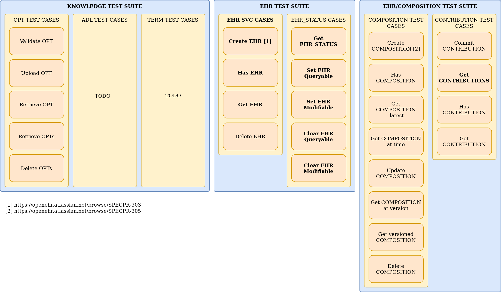
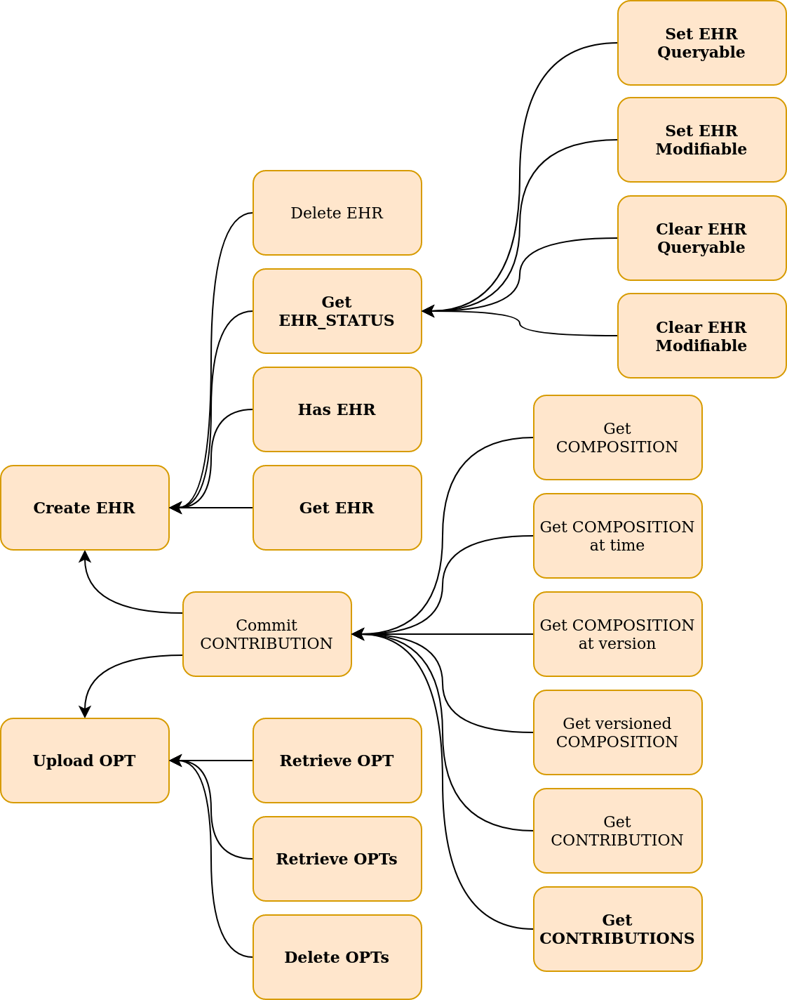

# openEHR Conformance Testing Specification

| Author                                           | Version          | Comments                                         |
|:------------------------------------------------:|:----------------:|:------------------------------------------------:|
| Pablo Pazos Gutierrez <pablo.pazos@cabolabs.com> | 1.0 (2021-04-14) | First version integrating all tests suites into a single documenation.     |

# Index
<!-- 
  $ git clone https://github.com/Chris3606/TOC-Generator
  $ cd TOC-Generator
  $ python tocgen.py ../ehrbase/doc/conformance_testing
-->
<!--ts-->
- [Introduction](#introduction)
- [General considerations](#general-considerations)
  - [Preconditions](#preconditions)
  - [Considerations](#considerations)
- [Test Suites](#test-suites)
  - [Test Suite Components](#test-suite-components)
    - [Knowledge](#knowledge)
    - [EHR](#ehr)
    - [EHR/COMPOSITION](#ehrcomposition)
    - [EHR/CONTRIBUTION](#ehrcontribution)
    - [DIRECTORY](#directory)
  - [Test Case Dependencies](#test-case-dependencies)
<!--te-->

# Introduction

This documentation contains different test suites focused on validating any implementation of the [openEHR Service Model](https://specifications.openehr.org/releases/SM/latest/openehr_platform.html) (SM). The SM is an abstract specification of services any openEHR implementation can provide. Currently the only concrete imlementable spec for SM is the [openEHR REST API](https://specifications.openehr.org/releases/ITS-REST/latest), that is why the openEHR REST API is considered an ITS artifact (Implementable Technology Specification).

# General considerations

## Preconditions

1. It should be able to run test suites against a clean server:
   - There are no EHRs
   - There are no commits (COMPOSITIONs, VERSIONs)
   - There are no templates or archetypes loaded
2. The server under test should provide some kind of authorization mechanism, for instance an auth endpoint on the REST API, or provide some kind of token, etc.

## Considerations

1. The server under test should be classified as "Custom API" or "openEHR API" (compliant with the openEHR REST API). This is needed in order to implement tests in code.
2. The supported IM version(s) by the server under test should be stated beforehand, because this will determine some variations on the data sets used for testing. The minimum required version is 1.0.2.
3. In most test frameworks pre conditions, setup, actions, post conditions, and cleansteps can be implemented
   - PRE would be to ensure the server is on a known state,
   - SETUP is for creating a specific state knowing the PRE is satisfied (for instance this will load some data),
   - then ACTIONS will alter that state and should not fail (actions can be positive or negative),
   - POST is a set of assertions that should be satisfied by the state after the ACTIONS, and
   - CLEAN is leaving the server in the state found at PRE.

# Test Suites

The following diagram shows the different components, suites, and test cases inlcuded in this Conformance Testing Specification.

## Test Suite Components

### Knowledge

This component includes the test suites for Operational Templates (OPT), Archetype Definition Language (ADL) and Terminology.

Since our focus was on OPT-based systems, the ADL component wasn't developed here.

The current status of an openEHR Terminology component is not completely defined by the current specifications, that component wasn't developed.

We'll leave both ADL and TERM test suites as placeholders here.

[Knowledge Test Suite](KNOWLEDGE.md)

### EHR

This component includes the test suites for EHR and EHR_STATUS, which test services related to EHR management.

[EHR Test Suite](EHR.md)

### EHR/COMPOSITION

This component includes the test suite for COMPOSITION related services, containing test cases focused on information content, including creation, modification and versioning.

[EHR/COMPOSITION Test Suite](EHR_COMPOSITION.md)

### EHR/CONTRIBUTION

This component includes the test suite for CONTRIBUTION related services, containing test cases focused on EHR data management, including creation, modification and versioning of COMPOSITION, EHR_STATUS and FOLDER.

[EHR/CONTRIBUTION Test Suite](EHR_CONTRIBUTION.md)

### DIRECTORY

This component includes the test suite for EHR.directory related services, which help to organize clinical documents inside the EHR.

[DIRECTORY](DIRECTORY.md)

## Test Case Dependencies

The following diagram shows the dependencies between the test cases. This is important since it shows in which order the different services should be used. For instance, the data required to execute one service should be created first by using another service.

The arrows should be interpreted as "depends on".

## Composition Validation Testing

Data validation against the constraints defined in an Operational Template (OPT) is a requirement of every openEHR CDR, to verify all the information committed to an EHR is compliant with the template that models that data set.

This testing component is focused on two main areas:

1. [Structural testing (types, existence, cardinality, occurrences, invariants)](COMPOSITION_VALIDATION_STRUCTURE.md)
2. [Datatype-specific constraints](COMPOSITION_VALIDATION_DATATYPES.md)

> NOTE: This testing component doesn't include testing of exchange formats against their schemas (XML/JSON), this is focused on validating a COMPOSITION instance against an OPT instance. The difference between these two types of validation is: the first is a "syntactic" validation, while the second is a "semantic" validation. Having an instance of a COMPOSITION implies it is "syntactically" valid, since the instance should follow the openEHR Reference Model.