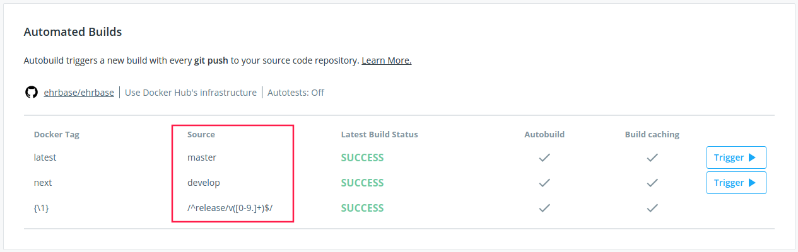
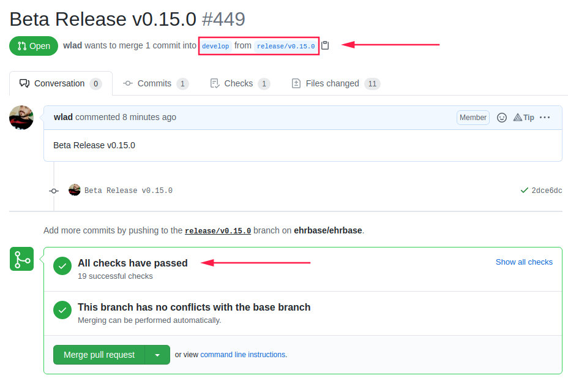
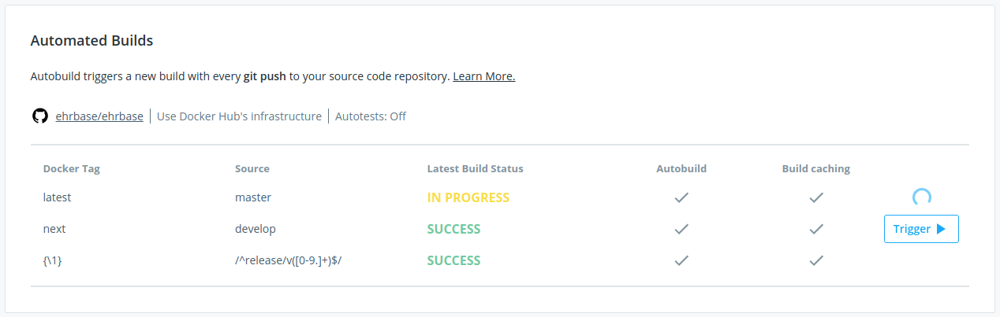

# EHRbase Release Checklist

This is a quick 10 step checklist to create and publish a new Github Release version of EHRbase. It's the bare minimal only - no Maven Central deployment involved. 

## 01. Checkout, fetch develop branch and make sure project builds

```    
git checkout develop
git pull
mvn clean package    # remember to start ehrbase DB before
```

- [ ] done

## 02. Create new release branch 

```
git checkout -b release/v0.15.0
```
NOTE: exact syntax is important (i.e. `v` before version number). Otherwise build rules on Docker Hub won't apply if branch name does not match properly



- [ ] done

## 03. Bump version (in all POM files that apply)

As of writing this (2021-02-25) the following POM files have to be updated
- [ ] pom.xml    
- [ ] api/pom.xml 
- [ ] application/pom.xml 
- [ ] base/pom.xml 
- [ ] jooq-pq/pom.xml 
- [ ] rest-ehr-scape/pom.xml 
- [ ] rest-openehr/pom.xml 
- [ ] service/pom.xml 
- [ ] test-coverage/pom.xml

Use one of below commands to update the version in all POMs at once:

```
# use this to bump major version (for releases with backwards incompatible changes) - ie. 0.14.0 --> 1.0.0
mvn build-helper:parse-version versions:set -DnewVersion=\${parsedVersion.nextMajorVersion}.0.0 versions:commit

# OR use this to bump minor version - i.e. 0.14. --> 0.15.0
mvn build-helper:parse-version versions:set \
    -DnewVersion=\${parsedVersion.majorVersion}.\${parsedVersion.nextMinorVersion}.0 \
    versions:commit


# bumping patch version is probably not suiteable for a new release but if you want - i.e. 0.14.0 --> 0.14.1
mvn build-helper:parse-version \
  versions:set \
  -DnewVersion=\${parsedVersion.majorVersion}.\${parsedVersion.minorVersion}.\${parsedVersion.nextIncrementalVersion} \
  versions:commit
```

- [ ] done 
    

## 04. Update CHANGELOG.md and README.md

- [ ] IN CHANGELOG:
    - replace top [Unreleased] with release version
    - add empty sections for next release's changes to the top, i.e.
        
        ```
        ## [Unreleased]

        ### Added

        ### Changed

        ### Fixed
        ```
    - edit version links at the buttom

        ```
        [unreleased]: https://github.com/ehrbase/ehrbase/compare/v0.15.0...HEAD
        [0.15.0]: https://github.com/ehrbase/ehrbase/compare/v0.14.0...v0.15.0
        ...
        ```

- [ ] IN README:
    - add new Releas version at the top

- [ ] done
    

## 05. Commit changes with proper message and push to remote (Github)
    
```
git commit -m "Updated release version to v0.15.0"
git push -u origin release/v0.15.0
```

- [ ] done

## 06. Merge into develop

- [ ] In Github's UI create a PR (Pull Request) from release branch into develop
- [ ] wait for CI to succeed - all checks have to pass!!!
- [ ] especially make sure that DockerHub build passes
- [ ] if needed continue committing to release branch until all CI checks pass



NOTES:
- remote release branch will be deleted automatically after merge
- your local release branch has to be deleted manually (do it at the end of the whole procedure)

- [ ] done

## 07. Add an annotated Git tag (and push it to remote)

- Now that we know all checks have passed on develop, let's finalize the release and give it a proper Git tag

```
git checkout develop
git pull
git tag -a v0.15.0 -m "Beta Release v0.15.0"
git push origin v0.15.0
```
- [ ] done

NOTE: if you messed up with Git tags, remember that you can delete them locally and on remote at any time, i.e.:
```
# delete a tag locally
git tag --delete v0.15.0

# delte a remote tag
git push --delete origin v0.15.0
```
    
## 08. Create a Release in Github UI

- navigate to '**Releases**' in EHRbase's repository
- click on '**Draft a new release**'
- input the tag created in step 7. (including `v` i.e. `v0.15.0`)

    NOTE: the input field provides autosuggestion to avoid typos

- select '**Target: develop**'
- give it a proper description
- click '**Publish release**'

- [ ] done


## 09. Merge into master

- [ ] OPTION I (on local machine)

```
git checkout master
git pull
git merge --no-ff develop
git push
```

- [ ] OPTION II (via Github UI)
    - create a PR from develop into master
    - merge PR
    - make sure CI and Docker Hub build pass



- [ ] done

## 10. Update release notes (in documentation repository)

- Copy & Paste properly all the stuff from CHANGELOG to Sphinx Docs

- [ ] done 
