# EHRbase security documentation

This page describes how to set up different security mechanisms in EHRbase and also provides some basic information
on how to configure your external security servers.

## Table of contents

- [EHRbase security documentation](#ehrbase-security-documentation)
  - [Table of contents](#table-of-contents)
  - [Introduction](#introduction)
    - [Supported security mechanisms](#supported-security-mechanisms)
  - [Basic Auth](#basic-auth)
  - [OAuth2](#oauth2)
  - [Appendix](#appendix)
    - [Keycloak with EHRbase](#keycloak-with-ehrbase)
      - [Setup for EHRbase](#setup-for-ehrbase)
      - [Conclusion](#conclusion)
    - [Postman for Keycloak (OpenID Connect)](#postman-for-keycloak-openid-connect)

## Introduction

The EHRbase Spring-Boot application can be configured to use different security mechanisms. They
are used to allow access to all resources only to authenticated users to protect stored data from
unauthenticated access.

A basic role system also defines permissions on different resources, e.g. the additional admin
endpoints are only accessible by users with the role `admin` configured.

By default EHRbase is started without security enabled (`NONE`) which will be reported by a message during
boot.

To enable authentication start the EHRbase application with environment variable `AUTH_TYPE` set
to the appropriate value or set the necessary data at one of the .yml files inside 
`{projectRoot}/application/src/main/resources/`.

### Supported security mechanisms

* None
* Basic auth
* Oauth2

## Basic Auth

The basic auth mechanism uses a predefined set of users and roles that will be configured during
start of EHRbase by setting the data inside the environment variables or inside the .yml file as
follows:

| ENV                        | .yml                       | Value to set        | Default                |
| -------------------------- | -------------------------- | ------------------- | ---------------------- |
| SECURITY_AUTHTYPE          | security.authType          | BASIC               | NONE                   |
| SECURITY_AUTHUSER          | security.authUser          | your username       | ehrbase-user           |
| SECURITY_AUTHPASSWORD      | security.authPassword      | Your password       | SuperSecretPassword    |
| SECURITY_AUTHADMINUSER     | security.authAdminUser     | Your admin username | ehrbase-admin          |
| SECURITY_AUTHADMINPASSWORD | security.authAdminPassword | Your admin password | EvenMoreSecretPassword |

To access a resource from a client generate the Base64 encoded string of `{username}:{password}` 
and add it in the Authorization header with `Basic {Base64 encoded string}`.

## OAuth2

OAuth2 uses an external authentication server realm to authenticate a user and provide additional
information about the role of each user.

To start EHRbase with OAuth2 support and configure the external server use one of the following
configuration methods:

| ENV                                                 | .yml                                                 | Value to set            | Default                                   |
| --------------------------------------------------- | ---------------------------------------------------- | ----------------------- | ----------------------------------------- |
| SECURITY_AUTHTYPE                                   | security.authType                                    | OAUTH                   | NONE                                      |
| SECURITY_OAUTH2USERROLE                             | security.oauth2UserRole                              | Desired user role name  | USER                                      |
| SECURITY_OAUTH2ADMINROLE                            | security.oauth2AdminRole                             | Desired admin role name | ADMIN                                     |
| SPRING_SECURITY_OAUTH2_RESOURCESERVER_JWT_ISSUERURI | spring.security.oauth2.resourceserver.jwt.issuer-uri | Your realm base url     | http://localhost:8081/auth/realms/ehrbase |

The realm, client and all other settings must be done inside the corresponding authentication
server. A basic example on how to do this with Keycloak from JBoss can be found in the [appendix](#keycloak-with-ehrbase) of
this page.

The user and admin role names are configurable, enabling compatibility with authentication servers which are opinionated
on the names of custom OAuth roles or scopes. EHRBase will look for the admin/user role in the `realm_access.roles` and
`scope` claims of the JWT provided on an authenticated request.

The clients must be implemented / configured to use the external authentication server as well.
There are multiple libraries for many frameworks available that can be used for this.

An example on how to use Postman with OAuth2 and Keycloak is available in the [appendix](#postman-for-keycloak) of this page as well.

## Appendix

### Keycloak with EHRbase

Keycloak is an OpenID Connect capable identity and access management server that has been tested 
with EHRbase. To get more information about this open source project go to https://www.keycloak.org/

In our examples we assume that you configured the Keycloak server at `http://localhost:8081` and
a realm named `ehrbase`.
Change the example data as needed by your configuration.

#### Setup for EHRbase

__Step 1__: Open the Keycloak interface and create a new Realm named `ehrbase`

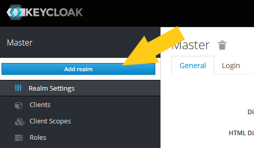

__Step 2__: Enter the realm name

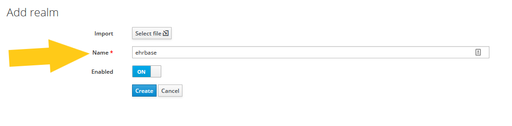

__Step 3__: Switch to Clients and hit the create button

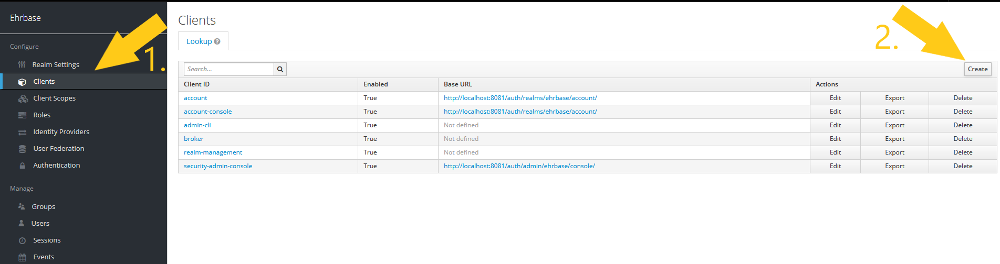

__Step 4__: Enter the client identifier

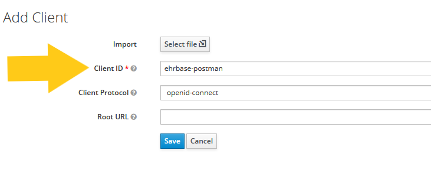

In this example we are creating a client for postman. You can add multiple clients for each
application that you want to add and share identification information with.

__Step 5__: Set basic client data

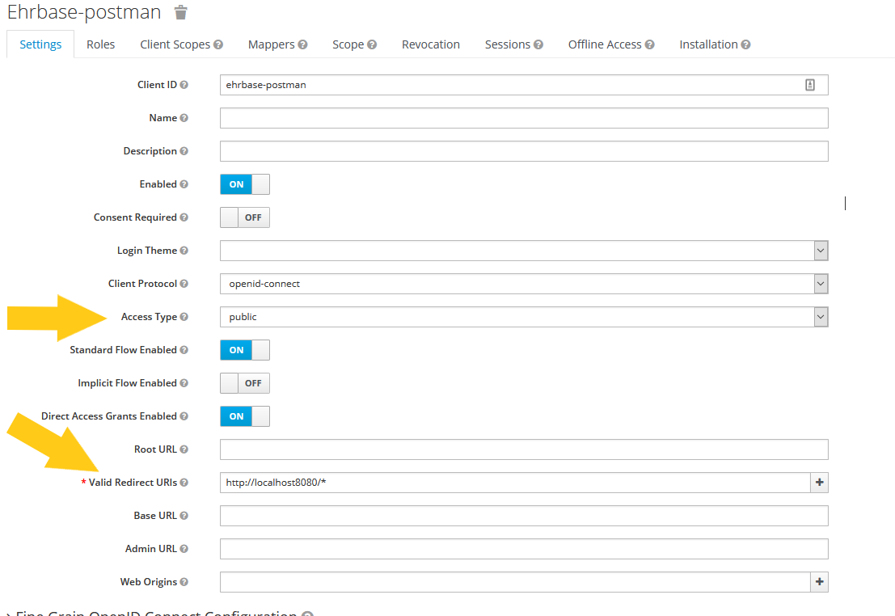

Ensure that you set _Access Type_ to `public` and add a _Valid Redirect URL_ entry for each
EHRbase host you want to secure with the client. We have only one thus we set it to
`http://localhost:8080/*`

__Step 6__: Navigate to Mappers and create new mapper

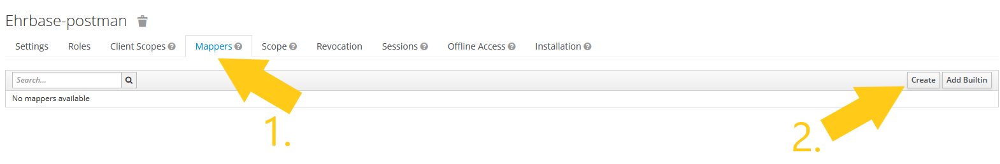

_Mappers are used to map the role information into the JWT that is used on the server to identify
the user_

__Step 7__: Enter name for new Mapper

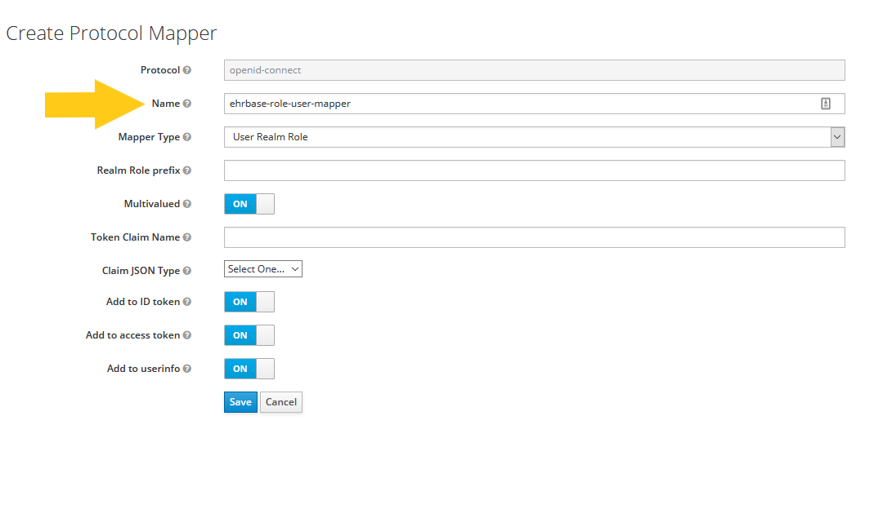

The name is only used inside Keycloak to identify this mapper. You can use a name as you want.
Ensure that the other values match the settings in the screenshot.

__Step 8__: Navigate to Roles and add a new role

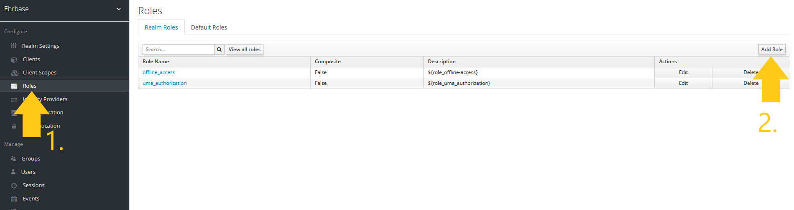

__Step 9__: Enter the name for user and admin roles

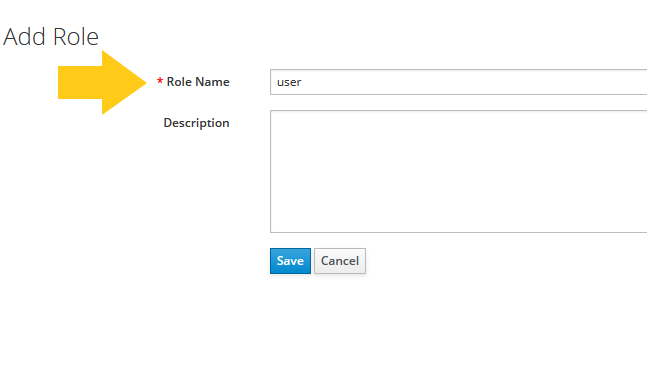

Do not use capital letters in role names since some clients are case-sensitive with the role name

__Step 10__: Navigate to users and create users as required

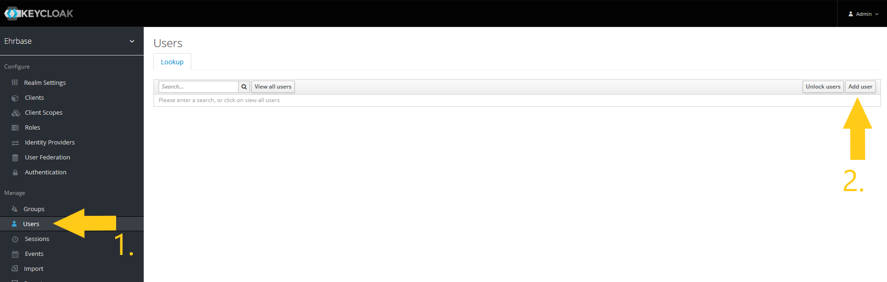

__Step 11__: Enter user name

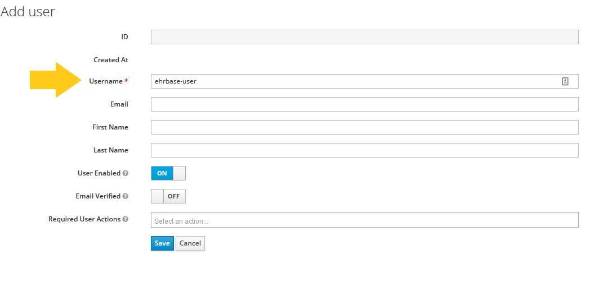

__Step 12__: Set credentials for the new user

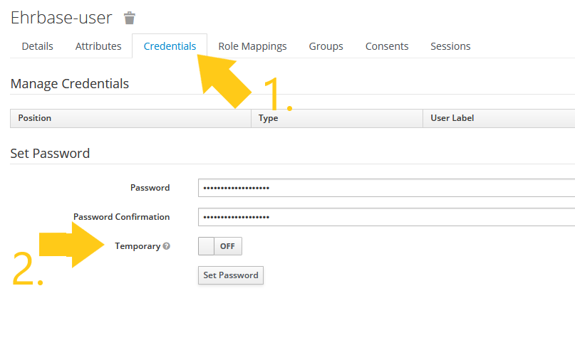

Ensure the password is entered twice and _Temporary_ is set to `Off`.

After hitting _Set Password_ an alert will open. Confirm the setting of the password.

__Step 13__: Assign roles for the user

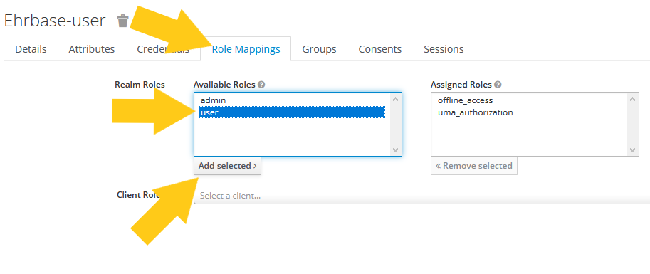

You can assign multiple roles to each user as you need. Each time you assign or remove a role
from a user the settings will be saved immediately.

#### Conclusion

You can add mutliple users for EHRbase as you need. For development purposes it is also imaginable
that you only add a user with an user and an admin role. For production environments it is
strictly recommended to use secure passwords and separate users for each role.

### Postman for Keycloak (OpenID Connect)

To use the EHRbase with the API develeopment tool Post you can use this instruction.

We assume that you set up the Keycloak as in the [appendix](#keycloak-with-ehrbase) for this
howto.

__Step 1__: Open Authorization tab of Collection/Folder/Request

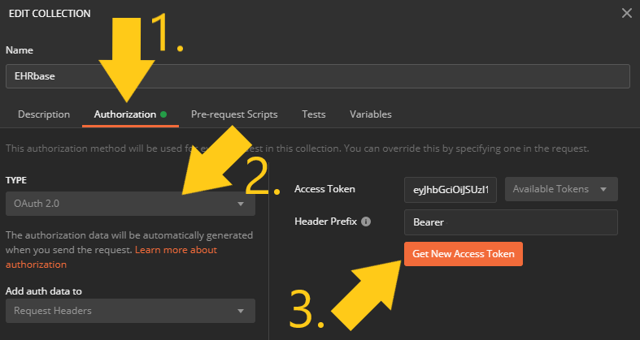

__Step 2__: Enter data of your Keycloak server

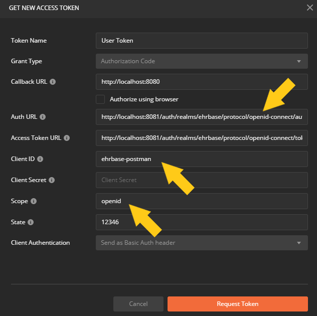

You can set a different name of the token to identify it later in Postman.

To get the URLs for _Auth URL_ and _Access Token URL_ you can open the following URL on your system
with the running Keycloak server: `{http://localhost:8081}/auth/realms/{ehrbase}/.well-known/openid-configuration`.
Adopt the name for your realm and the hostname:port as you configured it on your system.

__Step 3__: Hit Request Token and enter user credentials

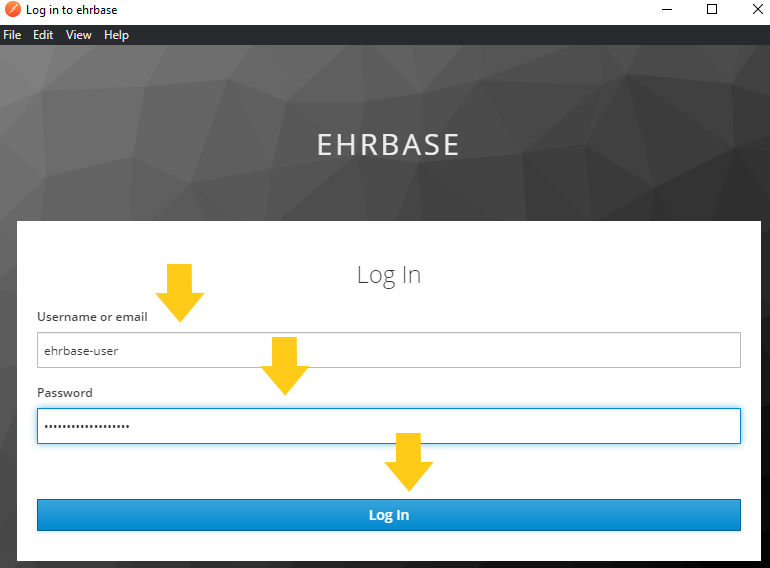

__Step 4__: Hit Use Token

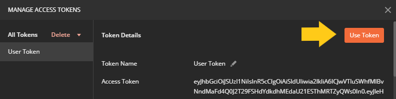

__Step 5__: Save and use the credentials

